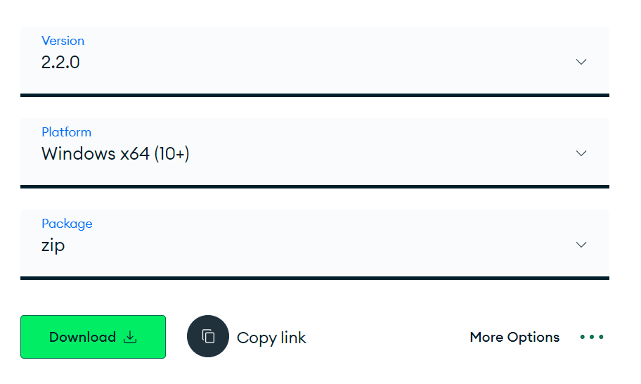
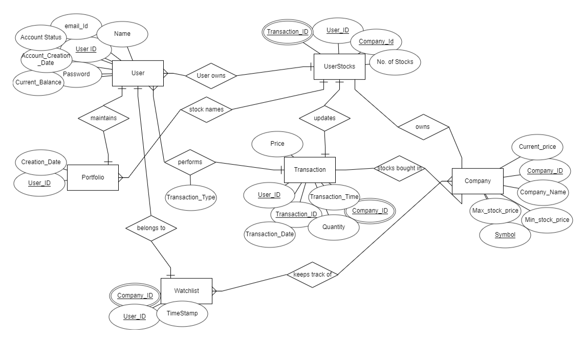

# Setup Instructions

1. Clone this repository.

    ```bash
    $ git clone https://github.com/JunihersGroup4/TitanTradeBackend.git
    ```

2. Create the `.env` file using the sample `.env`.

3. Run the following commands.

    ```bash
    $ yarn install
    $ yarn start
    ```

4. MongoDB setup
   - Install MongoDB Compass from [here](https://www.mongodb.com/try/download/shell).
   - Select your system configuration.
     <div style="text-align:center">
       
     </div>
   - Start MongoDB service using the following command in your terminal.
   
     ```bash
     sudo service mongod start
     ```

# ER Diagram

<div style="text-align:center">
  
</div>


# System Diagram

<div style="text-align:center">
  
</div>


# External API Used

## [Latest Stock Price](https://rapidapi.com/suneetk92/api/latest-stock-price/details)

### Introduction
It is used to fetch latest NSE stock price for 811 stocks.
Update frequency = 1 min
Latency = 635ms

### Authorisation
To use this API, an API key is needed. API key can be generated through the RapidAPI dashboard. Include your API key in the .env file under `RAPIDAPI_KEY` heading.

### Request Examples
Below is the code snippet for how it can be used.

```
const fetchAndUpdateStocks = async () => {
  const options = {
    method: "GET",
    url: "https://latest-stock-price.p.rapidapi.com/any",
    headers: {
      "X-RapidAPI-Key": process.env.RAPIDAPI_KEY,
      "X-RapidAPI-Host": process.env.RAPIDAPI_HOST,
    },
  };

  try {
    const response = await axios.request(options);
  } catch (error) {
    console.error(error);
  }
};

```

### Response Example
Below is how response is received from the api
```
  {
    symbol: 'WIPRO',
    identifier: 'WIPROEQN',
    open: 518,
    dayHigh: 518.55,
    dayLow: 509,
    lastPrice: 510,
    previousClose: 517,
    change: -7,
    pChange: -1.35,
    totalTradedVolume: 3196980,
    totalTradedValue: 1638356340.6000001,
    lastUpdateTime: '18-Mar-2024 15:59:38',
    yearHigh: 545.9,
    yearLow: 352,
    perChange365d: 37.32,
    perChange30d: -4.79
  }
```
### Implementation
We are periodically calling this api during the market hours to fetch real time stock data and storing it in the database.


